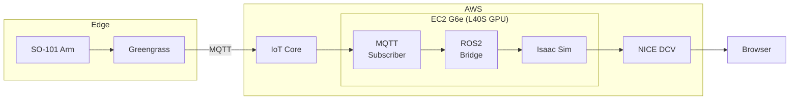

# Isaac Sim Digital Twin — LeRobot SO-101

Real-time digital twin of a LeRobot SO-101 robotic arm using NVIDIA Isaac Sim on AWS. Subscribes to 10Hz joint telemetry from AWS IoT Core (published by a Greengrass edge component) and mirrors the physical robot's movements in a simulated environment, streamed via NICE DCV.

## Architecture



See [Telemetry Data Format](docs/telemetry-format.md) for details on the IoT payload structure, joint mapping, and conversion pipeline.

## Prerequisites

- AWS account with G6e instance quota
- CDK CLI (`npm install -g aws-cdk`)
- Subscribe to [Isaac Sim AMI](https://aws.amazon.com/marketplace/pp/prodview-bl35herdyozhw) in your account
- Node.js 18+ and npm

## Setup & Deploy

1. **Configure project settings** — edit `config.json`:
   - Set `ec2.clientIpCidr` to your public IP (required for DCV access)
   - Optionally update `aws.region` or `ec2.amiMapping` for your region

2. **Deploy infrastructure**:
   ```bash
   cd infra
   npm install
   npx cdk synth              # validate CloudFormation
   npx cdk deploy IsaacSimDTStack
   ```

3. **Get DCV password**:
   ```bash
   aws secretsmanager get-secret-value \
     --secret-id isaac-sim-dt/dcv-password \
     --query SecretString --output text
   ```

## Test It

### Connect to Isaac Sim

1. Get DCV URL from stack outputs: `https://<public-dns>:8443`
2. Open in browser (Chrome/Edge recommended) or NICE DCV client
3. Enter DCV password from Secrets Manager
4. Alternative: SSH via Session Manager: `aws ssm start-session --target <instance-id>`

### Verify the Bridge

The bridge runs as a systemd service and starts automatically:

```bash
# Check service status
sudo systemctl status dt-bridge

# View live logs
sudo journalctl -u dt-bridge -f

# Restart if needed
sudo systemctl restart dt-bridge
```

### Test with Mock Data

Without a physical robot, use the mock publisher to simulate telemetry:

```bash
# From your local machine (requires IoT publish permissions)
pip install boto3
python tools/mock_publisher.py --rate 10
```

The simulated robot in Isaac Sim should move in response to the mock joint positions.

## On the EC2 Instance

If you need to run the bridge manually or debug:

```bash
# Verify AMI setup
bash /opt/digital-twin/backend/scripts/discovery.sh

# Run bridge manually
source /opt/ros/jazzy/setup.bash
cd /opt/digital-twin/backend
python3 bridge.py
```

## Clean Up

```bash
cd infra
npx cdk destroy IsaacSimDTStack
```

This removes all resources (EC2 instance, VPC, IoT certificates, Secrets Manager secret).
