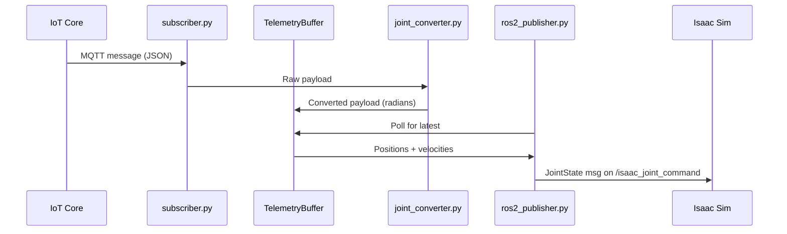

# Telemetry Data Format and Conversion Pipeline

Reference documentation for the digital twin telemetry data flow from IoT Core to Isaac Sim.

## 1. IoT Core Telemetry Payload

The Greengrass edge component publishes JSON to MQTT topic `dt/lerobot/<device-id>/telemetry` at 10Hz.

### Example Payload

```json
{
  "device_id": "arm-001",
  "timestamp": 1706000000000,
  "joints": {
    "shoulder_pan":  { "position": 2048, "velocity": 0,  "load": 25, "temp": 34, "current": 175 },
    "shoulder_lift": { "position": 2248, "velocity": 12, "load": 35, "temp": 36, "current": 205 },
    "elbow_flex":    { "position": 2298, "velocity": -5, "load": 30, "temp": 35, "current": 190 },
    "wrist_flex":    { "position": 2048, "velocity": 3,  "load": 15, "temp": 33, "current": 145 },
    "wrist_roll":    { "position": 2048, "velocity": 0,  "load": 10, "temp": 32, "current": 130 },
    "gripper":       { "position": 1800, "velocity": 0,  "load": 20, "temp": 33, "current": 160 }
  }
}
```

### Field Definitions

- **`device_id`**: Robot identifier (e.g., `"arm-001"`)
- **`timestamp`**: Unix epoch in milliseconds
- **`joints`**: Object containing 6 joints, each with:
  - **`position`**: Servo position in ticks (0–4096 range, 12-bit resolution). 2048 = home/neutral.
  - **`velocity`**: Servo velocity in ticks/second (signed integer)
  - **`load`**: Load percentage (0–100)
  - **`temp`**: Temperature in Celsius
  - **`current`**: Current draw in mA

The 6 joints correspond to motor IDs 1–6 on the SO-101 robotic arm.

## 2. Joint Name Mapping

The IoT telemetry uses descriptive joint names. Isaac Sim's USD model uses different names for the same physical joints.

| Motor ID | IoT Name | USD Joint Name | Description |
|----------|----------|----------------|-------------|
| 1 | shoulder_pan | Rotation | Base rotation |
| 2 | shoulder_lift | Pitch | Shoulder pitch |
| 3 | elbow_flex | Elbow | Elbow bend |
| 4 | wrist_flex | Wrist_Pitch | Wrist pitch |
| 5 | wrist_roll | Wrist_Roll | Wrist rotation |
| 6 | gripper | Jaw | Gripper open/close |

This mapping is implemented in `backend/joint_converter.py` via the `IOT_TO_USD` dictionary.

## 3. Position Conversion (Ticks to Radians)

The servos report position as encoder ticks (0–4096 for one full revolution). Isaac Sim expects joint angles in radians with 0 = home position.

### Conversion Formula

```
radians = (ticks - 2048) × (2π / 4096)
```

### Key Points

- **2048 ticks** (midpoint) → **0 rad** (home/neutral pose)
- **0 ticks** → **−π rad**
- **4095 ticks** → **+π rad**

This offset is critical — Isaac Sim's joint zero corresponds to the arm's neutral pose, not the servo's absolute zero.

## 4. Velocity Conversion

Velocity is a rate with no offset needed:

```
rad/s = ticks_per_second × (2π / 4096)
```

**Note**: Velocity values are currently published to ROS2 but NOT used by the Isaac Sim ArticulationController — only position commands drive the simulation.

## 5. Data Pipeline



### Pipeline Steps

1. **`subscriber.py`** connects to IoT Core via MQTT5 WebSocket with SigV4/IAM auth
2. Each incoming message is passed to **`joint_converter.convert_payload()`** which maps joint names and converts ticks to radians
3. The converted data is stored in a thread-safe **`TelemetryBuffer`** (single-slot, latest-value-wins)
4. **`ros2_publisher.py`** polls the buffer at 20Hz and publishes `sensor_msgs/JointState` messages to `/isaac_joint_command`
5. Isaac Sim's OmniGraph action graph subscribes to this topic and drives the ArticulationController

## 6. ROS2 JointState Message

The final ROS2 message format that reaches Isaac Sim:

```
header:
  stamp: <current_time>
  frame_id: "base_link"
name: ["Rotation", "Pitch", "Elbow", "Wrist_Pitch", "Wrist_Roll", "Jaw"]
position: [0.0, 0.307, 0.384, 0.0, 0.0, -0.380]
velocity: [0.0, 0.018, -0.008, 0.005, 0.0, 0.0]
effort: [25.0, 35.0, 30.0, 15.0, 10.0, 20.0]
```

### Field Usage

- **`name`** and **`position`**: Used by the ArticulationController to drive joint angles
- **`velocity`** and **`effort`**: Published for monitoring but not wired to the simulation (effort stores the load percentage)

The positions array order matches the names array and follows the motor ID sequence (1–6).
